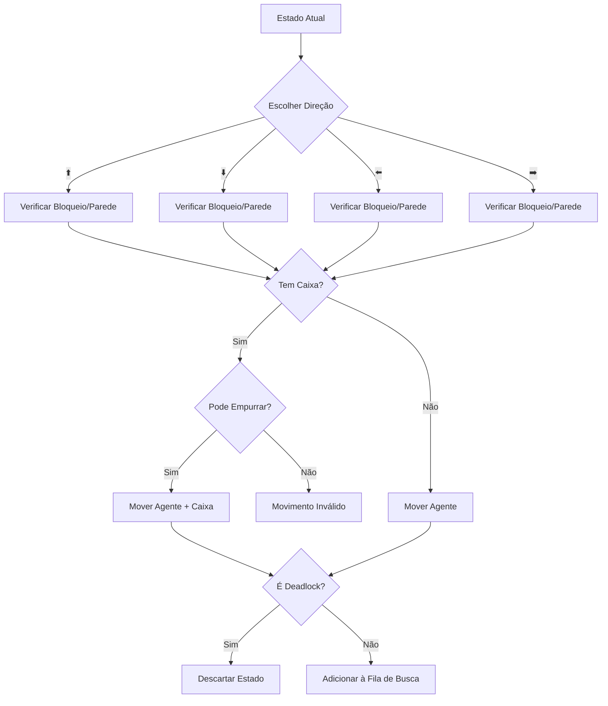

#Modelagem

 ## 📉 Análise de Escalabilidade: Cenário 64x64

Para o mapa de dimensões 64x64, nenhum dos algoritmos de busca (**Dijkstra, Ganancioso e A***) atingiu a convergência para um resultado numérico. Esta situação é justificada pelos seguintes pontos técnicos:

1. **Complexidade do Espaço de Estados**: O jogo Sokoban é um problema **NP-Difícil**. Em um grid de 64x64 (4.096 células), o número de combinações possíveis entre a posição do agente e das caixas gera uma "explosão combinatória".
2. **Limitação de Memória RAM (Dijkstra e A*)**: Para garantir a otimalidade, esses algoritmos armazenam cada estado visitado em um dicionário de controle para evitar ciclos e reprocessamento. O consumo de memória excedeu a capacidade do hardware doméstico antes que o objetivo fosse alcançado.
3. **Inviabilidade da Busca Gananciosa**: Embora foque na proximidade do objetivo através da heurística, o algoritmo Ganancioso pode cair em "platôs" ou loops infinitos em mapas desta magnitude, expandindo estados indefinidamente até o esgotamento de recursos.
4. **Poda e Eficiência**: A função `eh_deadlock` (Locker) filtra estados onde as caixas ficam presas em cantos, mas o volume de estados válidos restantes em um grid 64x64 ainda é proibitivo para execução em tempo real em hardware comum.

**Conclusão**: O sistema está logicamente validado pelos testes realizados nos grids 8x8, 16x16 e 24x24. O cenário 64x64 demonstra o limite físico de processamento e armazenamento para este problema clássico da Inteligência Artificial quando aplicado em escalas massivas.